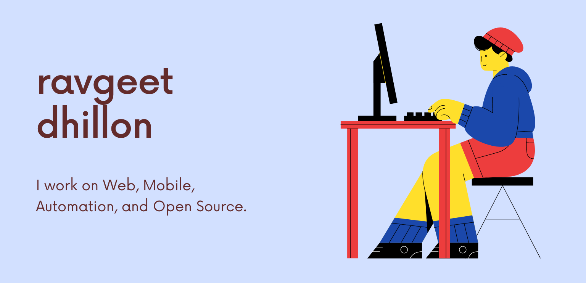

On this planet for **8510 days**. Written about **42398 words**.

# Hello Beautiful! 

### 😄 About

Currently, I am juggling between my studies and managing my [tech startup, RavSam](https://www.ravsam.in/). I am pursuing M.Tech in Computer Science and Engineering at Guru Nanak Dev University and will be post-graduating in 2022.

### 🙏 Open Source

I am a GNOME Foundation Member, where I contribute to Web and Engagement Teams. In 2019, I got a chance to redesign the [GTK Website](https://www.gtk.org/) as a Google Summer of Code Developer. That experience was life-changing for me as I learned some of the best software development practices from the GTK community.

### 💻 Study and Work

I love to explore new technologies. I use the following technologies to create data flows and amazing experiences for my clients and users. I try to automate almost everything that comes my way as it helps to improve my productivity and connection with my clients.

- **Python** - Almost Everywhere
- **Strapi** - CMS and API Development
- **Laravel** - Backend Development
- **Vue/Nuxt** - Front End Development
- **Flutter** - Cross-Platform App Development
- **Jekyll** - Static Site Generation
- **Netlify** - Deployment
- **Google Apps Script** - Automation

### 🖊️ Writing

I write blogs on my [startup's website](https://www.ravsam.in/blog/), [CSS Tricks](https://css-tricks.com/author/ravgeetdhillon/) as it helps me in connecting with people in the community. I have written about 42398 words. Writing blogs have helped me get my first customers, so I suggest everyone document their journey or learnings in the form of a web blog.

### 🎹 Music

Sometimes I decide to get away from tech life and dive straight into music production. I have [my Youtube channel](https://youtube.com/ravdmusic), where you can listen to my remixes and originals.

### 🤝 Be my next customer

If you are looking for Web, Mobile, or Software Development services, you are most welcome to [get in touch with me](mailto:ravgeetdhillon@gmail.com) or visit [RavSam](https://www.ravsam.in/). You can either reach out to me via [LinkedIn](https://www.linkedin.com/in/ravgeetdhillon/) or send your requirements to [our company email](mailto:info@ravsam.in).

Last updated by Github Actions on 06 Aug, 2021.
